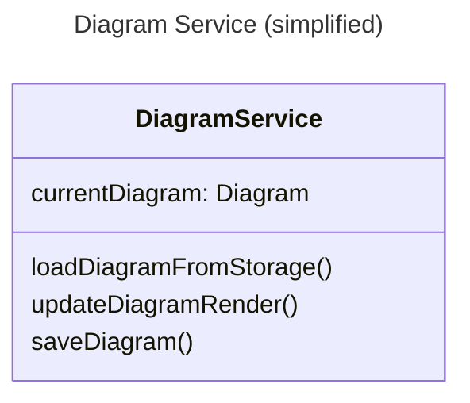
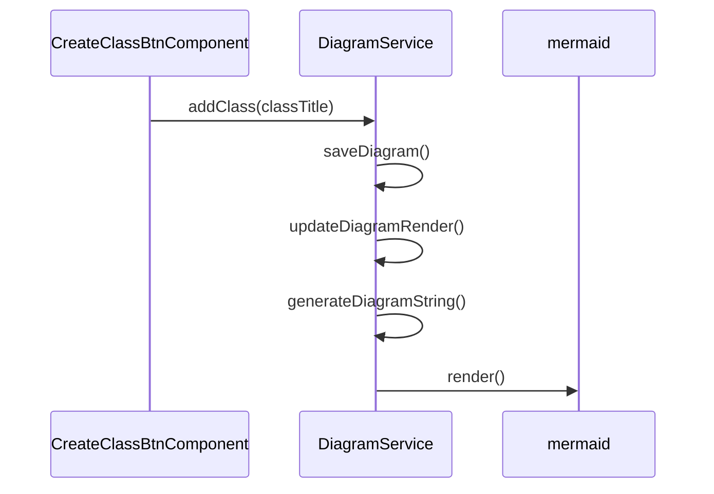

# Nereid

 

Diagram editor based on MermaidJS, born from my will to make class diagrams quickly but not finding a good alternative for linux.

Currently its only possible to save locally.

## How it works

### What happens when you add a class to the diagram?
<!-- lembrar de usar métodos como atores e agrupar eles nos rsepectivos services.  -->

## How to run

    npm install

    npm run ng serve

Then access [localhost:4200](localhost:4200)
