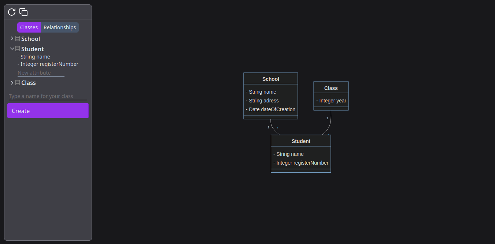

# Nereid

 

Diagram editor based on MermaidJS, born from my will to make class diagrams quickly but not finding a good alternative for linux.

## How to run

    npm install

    npm run ng serve

Then access [localhost:4200](localhost:4200)

## Goals

- [X] Basic interface elements (topbar, sidebar, mainview)
- [X] Class CRUD
- [ ] Attribute CRUD
- [ ] Method CRUD
- [ ] Relationship CRUD
- [ ] Mermaid logic (transpilation from models to mermaid code)
- ....

## Side Backlog

- Test attribute CRUD with reactive forms so maybe i wouldnt need to declare a new classes array in sidebar template